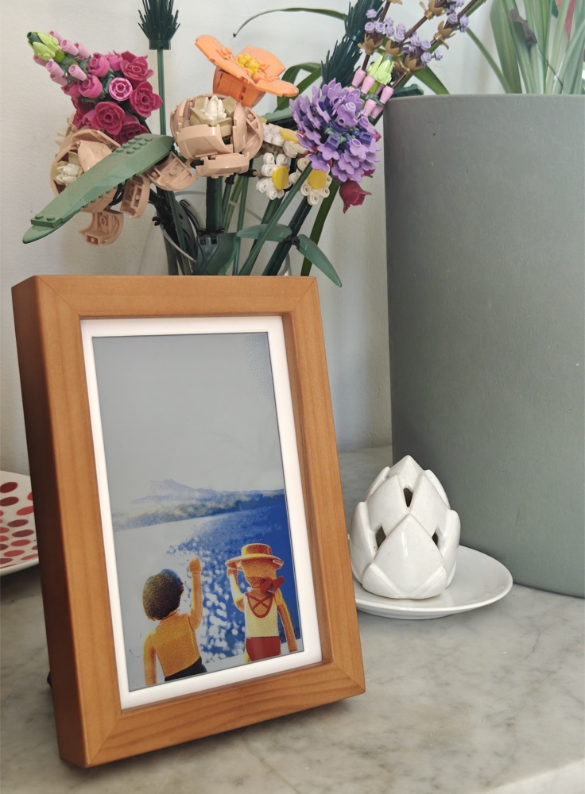

# 📷 Immich photopainter

<p align="center">
  
</p>

> 🖼️ A plug-and-play e-paper photo frame for the **Waveshare PhotoPainter ACCE** kit (7.3″ Spectra 6 color e-paper + Raspberry Pi Zero 2 W) that displays random photos from one of your **Immich** albums on the LAN, or from a **Local upload** library you drop directly into the web UI.

Everything — album, refresh frequency, orientation, display mode, language — is set from a **web UI hosted on the Pi**. No SSH, no YAML files to edit.

> Throughout this guide, `<your-host>` is **the hostname you set in Raspberry Pi Imager** (e.g. `photopainter`, `myframe` — whatever you chose). On most home networks you'll reach the Pi at `http://<your-host>.local/`. If that doesn't resolve, use the Pi's IP instead (find it in your router's DHCP list).


---

## ✨ Features

- 🗂️ **Two photo sources** — an **Immich** album on your LAN, or a **Local** library you upload through the web UI (drag-and-drop, JPG / PNG / WEBP, auto-resized to fit the frame). Switch between them in one click; each source keeps its own state, no mixing.
- 🎲 **Smart random photo** refreshed every **5–60 min** (configurable). Never-seen photos go first; once every photo has appeared at least once, the draw is weighted by *days since last seen* so an album of 500 photos cycles broadly without clones every other day. Each `(source, album)` keeps its own weighted-random history, so switching back and forth between Local and Immich doesn't reset anything.
- 🔄 **Rotation 0° / 90° / 180° / 270°** — hang the frame portrait, landscape, upside-down… the canvas adapts.
- 🎨 **Per-orientation display modes** — **fill** (crop to frame), **square** (1:1 centered), or **original** (full photo with bands). Bands color: white or black.
- 🎚️ **Image enhancement** sliders (brightness / saturation / sharpness) with a **Live preview** button to iterate on the panel without leaving the UI.
- 🗓️ **Weekly activity calendar (7×24)** — click any hour-cell to toggle it on/off, click a day label to flip the whole row, click an hour label to flip the whole column. Silent slots cost nothing on e-paper.
- 💾 **Per-source local cache (1–10 GB)** with nightly auto-purge + a manual **Clear cache** button — if Immich is offline, the frame keeps cycling from what it already has. The Local source needs no cache (its photos already live on the Pi).
- 🚨 **At-a-glance error badge** in the bottom-left corner of the photo: a wifi-off pictogram when the radio link is down, an alert-triangle for any other problem (Immich unreachable, crashes, …). Vanishes automatically once a cycle succeeds again.
- 📊 **Status block** with the photo's filename + EXIF capture date, plus a collapsible **activity log** (structured events, paginated, one-click clear) for easy troubleshooting.
- 🛠️ **Remote reboot / shutdown** of the Pi from the UI — no SSH needed.
- 🔁 **Survives reboots** — refresh lock and live preview live on persistent storage, the frame picks up automatically on power-up.
- 🌈 **Floyd-Steinberg dithering** against the native Spectra 6 palette — better color rendition than the stock Waveshare driver.
- 🌍 **Bilingual UI** (🇬🇧 / 🇫🇷), every preference persisted server-side (no cookies, no localStorage).
- 🔒 **LAN-only** by design (no auth needed, no cloud, no analytics).

---

## 📦 What you need

| | |
|---|---|
| 🧩 | **Waveshare PhotoPainter ACCE** kit (panel + HAT, assembled) |
| 🥧 | **Raspberry Pi Zero 2 W** (64-bit, 512 MB RAM) |
| 💾 | **microSD card ≥ 8 GB** from a real brand (SanDisk, Samsung, Kingston, Lexar) |
| 🔌 | A **USB-C charger** (a phone charger works) |
| 🏠 | A self-hosted **Immich** server reachable on your LAN — *optional*, you can also just drag-and-drop photos into the Local tab |
| 💻 | A computer with **Raspberry Pi Imager** installed |

---

## 🚀 Install

### 1️⃣ Flash the SD card

Open **Raspberry Pi Imager** → pick **Raspberry Pi OS Lite (64-bit)** → click the ⚙️ icon and set:

- **Hostname** : anything you want (`photopainter`, `myframe`…). Remember it — that's your `<your-host>`.
- **Username / password** : pick whatever you'll remember.
- **Wi-Fi** : your home SSID + password, the right country.
- **SSH** : ✅ enabled (password auth).
- **Locale** : your timezone + keyboard layout.

Click **Write** and wait.

### 2️⃣ Pre-enable SPI on the SD

Once the card is flashed, a partition called **`bootfs`** appears in your Finder / File Explorer. Open it and:

1. 📝 Open the file **`config.txt`** with any text editor (TextEdit, Notepad, VS Code…).
2. 🔍 Find the line that says **`#dtparam=spi=on`** (around line 8).
3. ✂️ Delete the **`#`** at the beginning so it becomes **`dtparam=spi=on`**.
4. 💾 Save the file.
5. ⏏️ Eject the **`bootfs`** volume safely (right-click → Eject).

### 3️⃣ Boot the Pi

Slide the SD into the Pi, plug the USB-C **into the HAT's port** (not the Pi's), and wait **~3 minutes** for the first boot (the Pi reboots itself once during cloud-init).

### 4️⃣ Install photopainter

```bash
ssh <your-user>@<your-host>.local
git clone https://github.com/snit-nelav/immich-photopainter.git
cd immich-photopainter
sudo ./install.sh
```

The install script takes care of everything (drivers, the [PWR_PIN patch](#-pitfalls), cron, the web service). ☕

### 5️⃣ Configure from the web UI

Open **`http://<your-host>.local/`** (or `http://<pi-ip>/`) on any device on your LAN. The page is bilingual (🇬🇧 / 🇫🇷, switcher top-right). Below the always-visible status, every section is **collapsed by default** — click its header to fold/unfold (`+` / `−`).

1. 📊 **Last cycle status** (always visible) — shows the filename + EXIF capture date of the current photo, a thumbnail preview, and a **↻ Refresh now** button.

2. 🖼️ **Photo album** — the section is organized in **source tabs**. Each tab has a **radio button** that becomes the active source on save; switching tabs flips the radio and turns the Save bar red until you confirm.

   - **Local** (default tab) — a drag-and-drop area where you drop photos (JPG / PNG / WEBP, max 50 MB each, auto-resized to fit the frame). The library shows as a scrollable 4-column grid; click thumbnails to multi-select, then use **🗑 Delete** to remove them or **⬇ Download** to grab a ZIP of the selection. A storage bar in the toolbar shows how full the SD card is (turns red above 85 %). Duplicates (same filename) are skipped, not re-uploaded. No cache to configure — the photos already live on the Pi.
   - **Immich** — fill in the **Immich URL**, the **API key** (built-in tutorial lists the 3 permissions: `album.read`, `asset.read`, `asset.download`), and pick an **Album** from the dropdown that auto-fills after URL + key are saved. At the bottom, a **Local cache** slider (1–10 GB) + **Clear cache** button — kept *per source* so a future Google Photos tab won't mix with this one.

3. 🗓️ **Schedule**
   - **Refresh frequency** — `5 / 10 / 15 / 20 / 30 / 45 / 60 min`.
   - **Activity calendar** — 7×24 grid (Mon–Sun × 0h–23h). Click a cell to toggle it. Click a day label to flip the whole row, click an hour label to flip the whole column. Presets: `All on` / `All off`.

4. 📐 **Layout**
   - **Frame orientation** (`0° / 90° / 180° / 270°`) — match the way you hang it.
   - **Display mode** for photos that match the frame's orientation **and** for those that don't (`fill`, `square`, or `original`), plus the **bands color** (white / black) for square / original.

5. 🎚️ **Image enhancement** — brightness / saturation / sharpness sliders (range `0.0 – 2.0`, `1.0` = identity). The **👁 Live preview** button pushes the current photo to the panel with the new values so you can iterate without leaving the page.

6. 🛠️ **System** — two sub-blocks:
   - **Maintenance** — `⟳ Reboot` and `⏻ Shutdown` buttons (each with a confirmation prompt).
   - **Logs** (nested collapsible) — paginated event log with **Load more** / **Clear** buttons.

Hit **💾 Save** (sticky bottom-right bar — gray when there are no changes, red when there are). A first photo appears on the panel in ~25 seconds. 🎉

That's it — the frame refreshes on its own from now on. If something breaks, a small **🚨 error badge** appears in the bottom-left of the photo (wifi-off icon for radio problems, alert-triangle for everything else); it vanishes on its own as soon as a cycle succeeds again.

---

## 🚧 Pitfalls

Two things will trip up the unwary. The install script handles both for you, just so you know:

- ⚡ **`PWR_PIN = 27` (not 18)** — the generic [`waveshareteam/e-Paper`](https://github.com/waveshareteam/e-Paper) repo defaults to GPIO 18, but the PhotoPainter ACCE HAT uses **GPIO 27**. Skip the patch and the screen stays blank with `init()` silently returning 0.
- 💾 **Counterfeit SD cards** — fake cards corrupt ext4 within hours. Buy a real branded card. The install script warns you if it spots one.

---

## 📄 License

[MIT](LICENSE).
